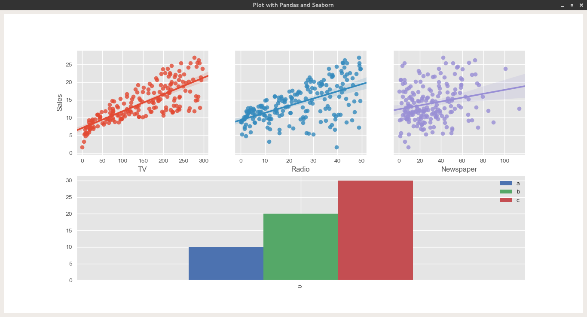

Embed Pandas and Seaborn On PyQt5
======================

 

It has been tested with python 2.7, unfortunately with python3 I have had problems between the backed pyqt4 and pyqt5:

	Traceback (most recent call last):
	  File "main.py", line 15, in <module>
	    from PyQt5 import QtCore, QtWidgets
	RuntimeError: the PyQt5.QtCore and PyQt4.QtCore modules both wrap the QObject class