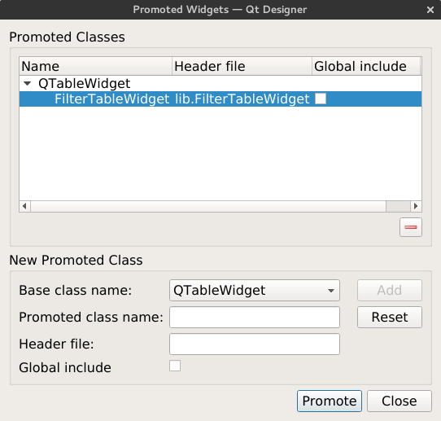

First we create the following structure:
	
	├── filter.ui
	├── lib
	│   ├── FilterTableWidget.py
	│   └── __init__.py
	├── main.py
	└── Rts.csv
	

Then we promote our widget (QtableWidget) to the custom widget (FilterTableWidget).

1. Right click on our QTableWidget and select **Promoted to ...**

 

2. The form is completed with the following fields:

	  Promoted class Name: FilterTableWidget
	  Header file: lib.FilterTableWidget

 

3. Click the Add button and then the promote button

 