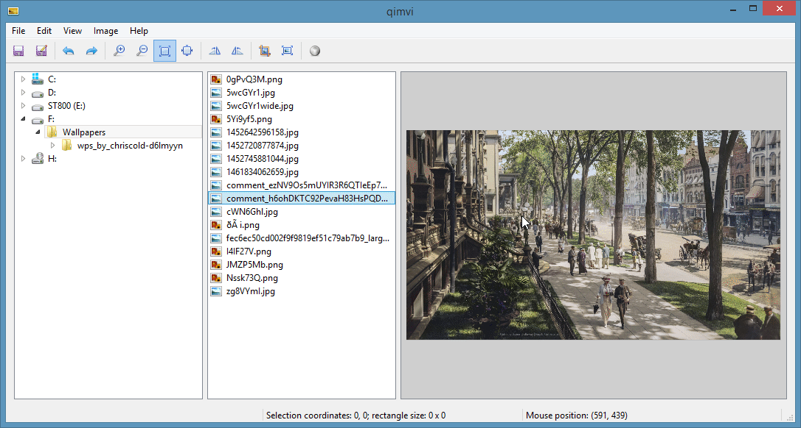

# qimvi
qimvi is an image viewer written in Qt 5.7. It can browse images on you computer as well as make simple edits.
Following features are provided:
* Resizing (scaling)
* Rotate left and right
* Crop to selection
* Convert to greyscale
* Saving changes

qimvi is MIT licensed.

##Demo animations

###Crop to selection

###Convert to greyscale

###Resize

