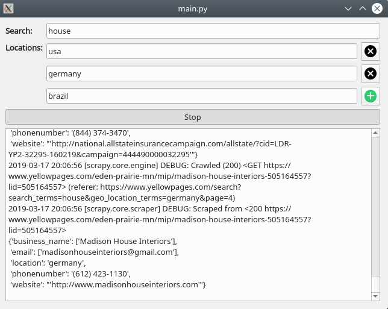

# Command Line:

```bash
foo@bar:~$ cd scrape
foo@bar:~$ scrapy crawl yellow -a parameters='{"search_item": "house", "locations": ["usa", "germany", "brazil"]}'
``` 

# Terminal:

```bash
foo@bar:~$ python terminal.py 
Input The Search Item: house
Location:usa
Do you want to add a new location?: [y/n]: y
Location:germany
Do you want to add a new location?: [y/n]: y
Location:brazil
Do you want to add a new location?: [y/n]: n
2019-03-17 21:20:04 [scrapy.utils.log] INFO: Scrapy 1.6.0 started (bot: scrape)
2019-03-17 21:20:04 [scrapy.utils.log] INFO: Versions: lxml 4.3.2.0, libxml2 2.9.9, cssselect 1.0.3, parsel 1.5.1, w3lib 1.20.0, Twisted 18.9.0, Python 3.7.2 (default, Jan 10 2019, 23:51:51) - [GCC 8.2.1 20181127], pyOpenSSL 19.0.0 (OpenSSL 1.1.1b  26 Feb 2019), cryptography 2.6.1, Platform Linux-5.0.2-arch1-1-ARCH-x86_64-with-arch
2019-03-17 21:20:04 [scrapy.crawler] INFO: Overridden settings: {'BOT_NAME': 'scrape', 'NEWSPIDER_MODULE': 'scrape.spiders', 'ROBOTSTXT_OBEY': True, 'SPIDER_MODULES': ['scrape.spiders']}
2019-03-17 21:20:04 [scrapy.extensions.telnet] INFO: Telnet Password: 4e483d3feaf29d17
2019-03-17 21:20:04 [scrapy.middleware] INFO: Enabled extensions:
...
```  

# GUI:


```bash
foo@bar:~$ python gui.py
``` 

   